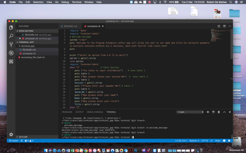
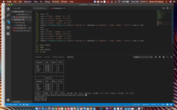
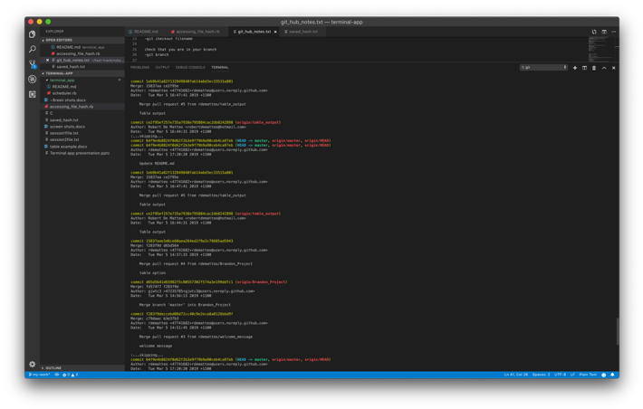
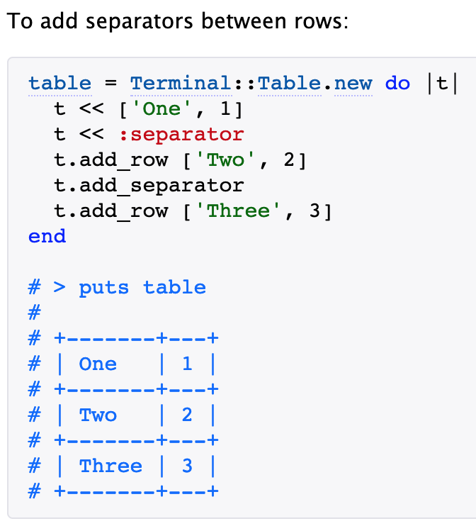

# terminal_app
Terminal App - Robert De Matteo and Brandon Cooper

Title of terminal app: "Program Schedular"

Plan is approved by Simon

## A link to your GitHub repository: https://github.com/rdematteo/terminal_app

Ensure the repository (repo) is accessible by your Educators

Images using github

## Description of the app, including,
Purpose, Functionality, Instructions for use, Screenshots
This Program schedular app "scheduler.rb' will allow the user to set name and title for multiple speakers in multiple sessions. The app only includes 2 sessions, each with four(4) time slots.
  
## Instructions
Choose your option from the startup.
If you choose 1, then you can choose to edit session 1 or session 2. Each selection (session 1 or 2) will then allow you to add the name and title for a speaker. You can repeat process to over-write data.
If you choose 2, then you can display the entire program with all entered speakers.

## Details of design & planning process including,
Evidence of app idea brainstorming sessions, app User/Workflow diagram
App idea brainstorming and user/workflow was evidenced in Trello (screenshots included)

Brandon to work on

1. Table options and 2. hash structure
Rob to work on 1. Welcome message and 2. Output table  3. file saving

## Project plan & timeline; 
Day 1 - Have majority of code completed.  
Day 2 - Complete code and testing. Prepare Powerpoint presentation. Pull all evidence into readme.

## Design issues.
### Rob
1. Welcome message
No issues 

2. Output table - using terminal-table 1.8.0 gem https://rubygems.org/gems/terminal-table
Could not use the code that uses separaters because could not insert title or headers.

Solution: 

Used this code instead: table = Terminal::Table.new :title => "Cheatsheet", :headings => ['Word', 'Number'], :rows => rows

3. Saving and retriving information system

need to use the JSON gem

decided on saving hashes into a txt file as JSON can save and read hashes

Issues.

1.JSON can only read all hasehes when hashes are appended. JSON cannot read hashes if the txt file contains \n. 

Solution: Saved each hash into a new file. Need to retrieve each file and name each with corresponding session name

2. The code was designed to save session 1 information into one file then save information from session 2 into another file. If the user did not input data for Session 1 and inputted information for session 2, hash was saved into the session file and not session 2 file. The app brock when output table was called. 

Solution: created a master hash with keys and blank values for each session. These hashes were saved into approriate files, regardless of user input.  

3. If user went back into app and only entered data for one speaker, the original hash was written over and all data except current input was lost.

Solution. This bug was not fixed. However, another menu item could be added where the user had access to the saved file and could change only certain hash vales.

